# TP0 - Words Counter - Taller de Programacion 1
Alumno: Tomas Szemzo - Padrón: 97771

## Resolución del Trabajo

### Paso 0

**a) Capturas de pantalla de la ejecución del aplicativo (con y sin Valgrind).**

Con valgrind:

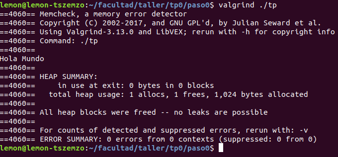

Sin valgrind:

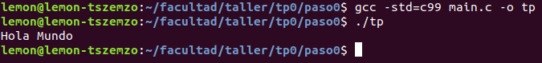

**b) ¿Para qué sirve ​Valgrind​? ¿Cuáles son sus opciones más comunes?**

Valgrind sirve para debuggear y detectar problemas con la memoria, es decir, hallar memory leaks (fugas). 

La opción mas comun es la de memcheck que es la que viene por default. Esta detecta memoria no inicializada, fugas de memoria, lecturas o escrituras de memoria luego de ser liberadas o en áreas del stack que no corresponden, entre otros inconvenientes. Por otro lado, también se encuentran presentes otras opciones como: addrcheck, massif, helgrind, cachegrind, entre otras.
				
**c. ¿Qué representa sizeof()? ¿Cuál sería el valor de salida de sizeof(char) y sizeof(int)?**

Sizeof es una función que pretende devolver el número de bytes que ocupa cualquier estructura de datos que le pasemos por parámetro. El valor de salida de sizeof(char) sería de 1 (1 byte) mientras que sizeof(int) seria 4 (4 bytes).
		
**d. ¿El sizeof() de una struct de C es igual a la suma del sizeof() de cada uno sus elementos? Justifique mediante un ejemplo.** 

No necesariamente. Por ejemplo si tenemos el siguiente struct:

```c
  struct foo_t {
    int x;
    char c
  };
```
Su sizeof será igual a 8 en vez de 5 que es lo que sumarían sus elementos por separado. Esto se debe al padding que agrega el compilador, por motivos de performance. Esto podría evitarse usando *Packing* en el struct. En ese caso si nuestro size of sería igual a 5.

**e. Investigar la existencia de los archivos estándar: STDIN, STDOUT, STDERR. Explicar brevemente su uso y cómo redirigirlos en caso de ser necesario (caracteres > y <) y como conectar la salida estándar de un proceso a la entrada estándar de otro con un pipe (carácter | ).**

Stdin, stdout y stderr son son los tres canales standard para entrada, salida y salida de errores. Por default, el standard input es la lectura por teclado, mientras que el standard output y el standard error son imprimir por pantalla. Estos 3 punteros pueden ser usados como argumentos en funciones.

Mediante redirección (>, <) y piping ( | ) podemos conectar estos 3 canales entre programas y archivos para dirigir la data que queramos de modo de combinarlos para llegar al resultado que deseamos.

### Paso 1

**a. Captura de pantalla mostrando los problemas de estilo detectados. Explicar cada uno.**

*Captura 1 : stdouterr de la tarea: Verificar Normas Codificación*
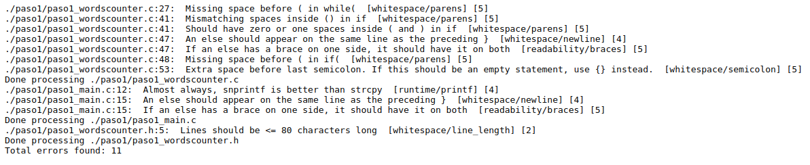

En orden:
* Línea 27 de wordscounter: no hay un espacio luego del while previo al paréntesis (style)
* Línea 41 de wordscounter: hay dos espacios dentro de la condición del if. El lint recomienda o poner uno o ninguno (style)
* Línea 47 de wordscounter: menciona que el else debería estar en la misma línea que la llave de cierre anterior, no en la línea siguiente. (style)
* Línea 48 de wordscounter: falta un espacio luego del if para separar la condición del if(style)
* Línea 53 de wordscounter: hay un espacio además previo al “;” que enuncia el fin de línea.
* Línea 12 de main: recomienda usar snprintf en vez de strcpy.
* Línea 15 de main: menciona que el else debería estar en la misma línea que la llave de cierre anterior, no en la línea siguiente. (style)
* Línea 5 de wordscounter.h: la línea del comentario supera los 80 caracteres.

**b. Captura de pantalla indicando los errores de generación del ejecutable. Explicar cada uno e indicar si se trata de errores del compilador o del linker.**

*Captura 2: stdouterr de la tarea: Compilar C99 Simple
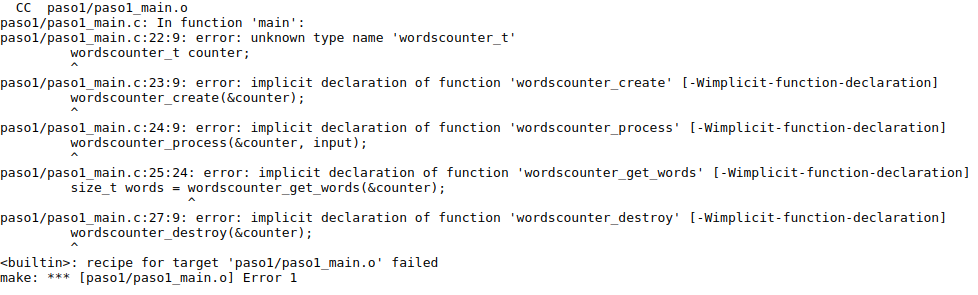

Aquí los errores de la generación del ejecutable parten de que en la línea 22 y a posteriori se quiere crear y utilizar el struct words counter junto con algunas funciones definidas en su módulo, pero este no se incluye en el main. Falta el #include del .h. Se trata de errores del linker dado que no puede resolver las dependencias dadas.

**c. ¿El sistema reportó algún WARNING? ¿Por qué?**

No, son solo errores los que reporta el sistema.

### Paso 2
**a. Describa en breves palabras las correcciones realizadas respecto de la versión anterior.**

En orden de salida del diff:
* se cambio la función strcpy por memcpy.
* se corrigió el uso de los else en la misma línea de la llave que cerraba el bloque anterior.
* se corrigió todos los problemas de espaciado (separación del while, de un if, etc.)

**b. Captura de pantalla indicando la correcta ejecución de verificación de normas de
programación.**

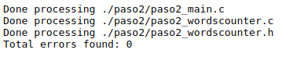

**c. Captura de pantalla indicando los errores de generación del ejecutable. Explicar cada uno e indicar si se trata de errores del compilador o del linker.**

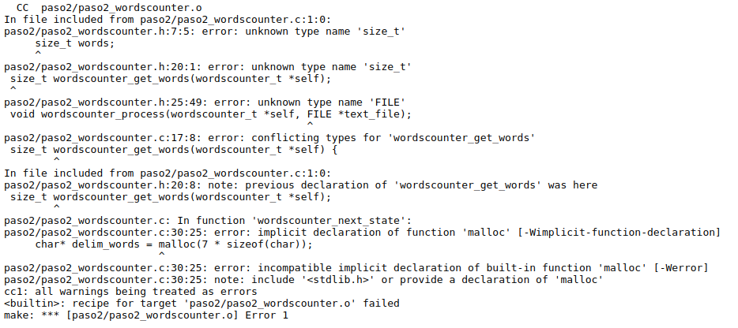

En orden:
* línea 7 y 20 del wordscounter.h: no conoce el type size_t: para solucionarlo debería incluir <stddef.h> en el .h. Esto desencadena varios de los errores a posteriori.
* línea 25 del wordscounter.h: no conoce el type FILE, dado que el .h no se incluye el <stdio.h>
* línea 17 del wordscounter.c: como no está bien definido en el .h por el problema mencionado anteriormente, lanza conflicting types en el .c
* línea 30 del wordscounter.c: falta hacer el #include <stdlib.h> por eso no puede llamar a malloc.

Son todos errores del linker.

### Paso 3

**a. Describa en breves palabras las correcciones realizadas respecto de la versión anterior.**

No hay muchos cambios, se agrega el stdio.h y string.h en el wordscounter.h lo que elimina algunos errores de la entrega anterior. Por otro lado, se importa stdlib.h en el wordscounter.c lo cual permite que hagamos las llamadas a malloc.

**b. Captura de pantalla indicando los errores de generación del ejecutable. Explicar cada uno e indicar si se trata de errores del compilador o del linker.**

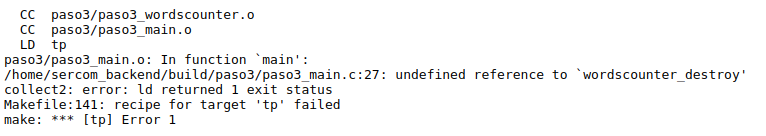

Aca el unico error que vemos es del linker, y ocurre dado que en la línea 27 del main.c se hace una llamada a una función que está declarada en el .h pero no definida luego en el .c.

### Paso 4
**a. Describa en breves palabras las correcciones realizadas respecto de la versión anterior.**

El único cambio que hubo fue “implementar” la función destroy que nos estaba fallando anteriormente. En este caso, la función no hace nada pero está implementada, por lo que no falla la compilación.

**b. Captura de pantalla del resultado de ejecución con Valgrind de la prueba ‘TDA’. Describir los errores reportados por Valgrind.**
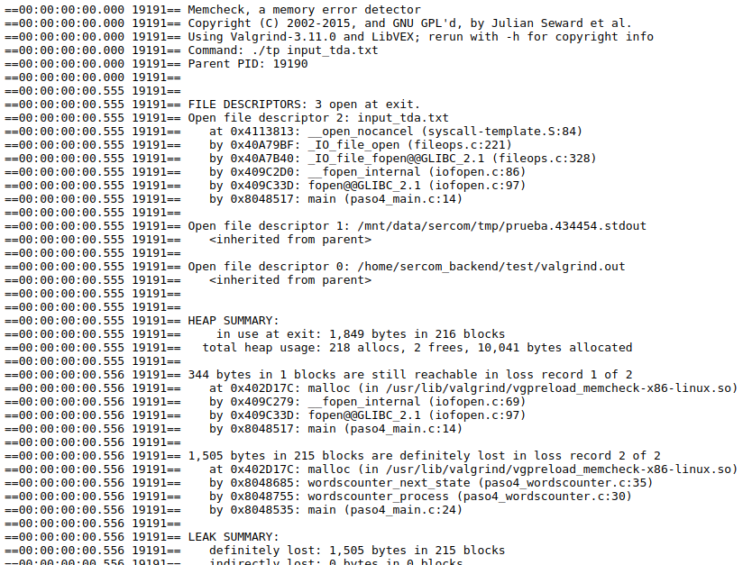

Aca valgrind nos muestra dos errores. En primer lugar, nos menciona que tenemos memoria “still reachable”, es decir, memoria que si el programador hubiese querido, podría haberla liberado (podría no considerarse un leak necesariamente), esto ocurre en el main.c línea 14 donde se hace un fopen.

Distinto es el caso del segundo leak en donde directamente se pierde la referencia del puntero y por eso no puede ser liberado (definitely lost). Esto ocurre en wordscounter.c línea 35 en donde se hace un malloc y nunca se libera esa memoria.

**c. Captura de pantalla del resultado de ejecución con Valgrind​ de la prueba ‘Long Filename’. Describir los errores reportados por Valgrind.**
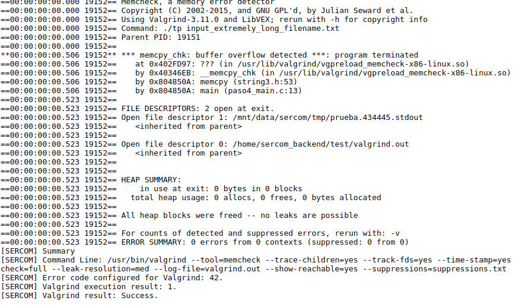

El error que menciona valgrind en este caso, es un buffer overflow en la operación memcpy del main (linea 13), en donde el filename del input file name es muy largo y por eso lanza el error. Una forma de evitarlo sería chequear que el destination buffer tenga suficiente espacio para alojar al source buffer.

**d. ¿Podría solucionarse este error utilizando la función strncpy ? ¿Qué hubiera ocurrido con la ejecución de la prueba?**

Si, podría solucionarse, en el sentido de que no explotaría. Ahora bien, strncpy copiaria los N caracteres siendo N el largo del parámetro source (como se usa en el programa) pero no sería nada seguro dado que no es null-terminated, es decir, no agrega el \0 al final de la copia lo cual podría generar problemas en caso de que el src sea mayor al buffer destino. Si es menor, simplemente haría padding agregando el “\0”.

**e. Explicar de qué se trata un segmentation fault y un buffer overflow.**

Un segmentation fault se da cuando se trata de leer o escribir en un área de memoria ilegal. 
La memoria de un programa está dividida en distintos segmentos (data, text, stack, heap) entonces por ejemplo un seg fault puede darse cuando intentamos referenciar una variable (data segment) en un segmento que no es el de data, o cuando usamos un puntero sin definirlo previamente, etc. 

Ahora, cuando hablamos de buffer overflow, nos referimos a cuando uno quiere realizar una operación de escritura sobre un buffer en el cual nos estamos pasando de su límite. Por ejemplo, si nosotros tenemos un char array[10], nuestro limite sera array[9], si nosotros queremos escribir más allá de ese límite estaremos en un buffer overflow.

### Paso 5

**a. Describa en breves palabras las correcciones realizadas respecto de la versión anterior.**

Se elimina el memcpy que mencionabamos en el paso anterior que corría riesgo de que aparezca un buffer overflow. Y se agrega en el main el fclose, para cerrar el filedescriptor correspondiente. Luego, en el .c en vez de alocar memoria se define el string con los delimitadores como un array lo cual veo mucho mejor.

**b. Describa el motivo por el que fallan las prueba ‘Invalid File’ y ‘Single Word’. ¿Qué información entrega SERCOM para identificar el error? Realice una captura de pantalla.**

Desde SERCOM, para la prueba Invalid FIle, tenemos dos casos: Correr y Valgrind-FailOnError. Para este paso, nos esta fallando solo el caso Correr, donde vemos que el detalle del error menciona: 'Se esperaba terminar con un código de retorno 1 pero se obtuvo 255’. Es decir, el codigo fallo pero no con el código de retorno esperado.

Con respecto a la prueba 'Single Word', fallan los dos casos y podemos ver en las diferencias que lo que se esperaba era que ocurra un error, pero sin embargo la ejecución terminó con éxito. También nos muestra que la tarea Valgrind-FailOnError tiene su salida por Valgrind en donde vemos que quedaron dos file descriptors abiertos, por lo cual se está quejando. A continuación la captura:

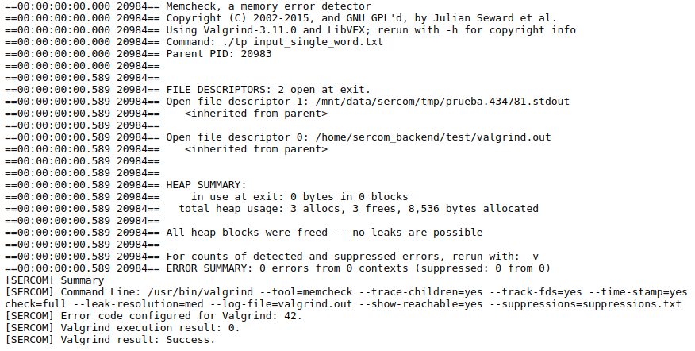

**c. Captura de pantalla de la ejecución del comando hexdump . ¿Cuál es el último carácter del archivo input_single_word.txt?**

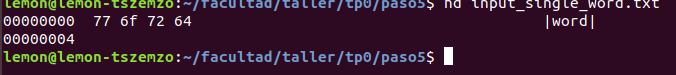

El ultimo caracter es la letra ‘d’ que su codigo ascii en hexadecimal es el 64.

**d. Captura de pantalla con el resultado de la ejecución con gdb​ . Explique brevemente los comandos utilizados en gdb​ . ¿Por qué motivo el debugger no se detuvo en el breakpoint de la línea 45: self->words++; ?**

Agrego capturas de pantalla e info en orden:

**info functions:** como vemos en la captura nos lista las funciones disponibles en nuestro programa

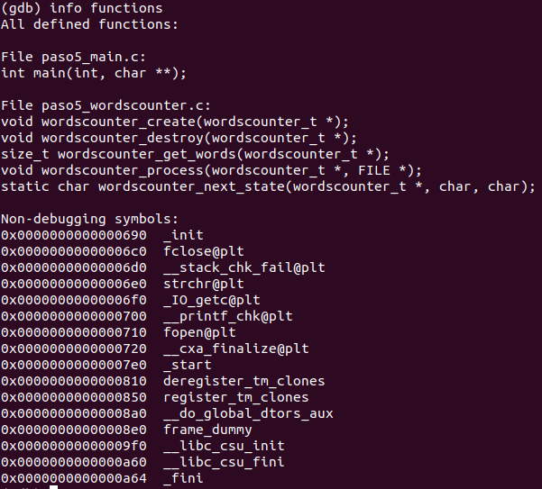

**list wordscounter_next_state:** en este caso list <function> nos muestra las primeras líneas de una función, como una preview.
	
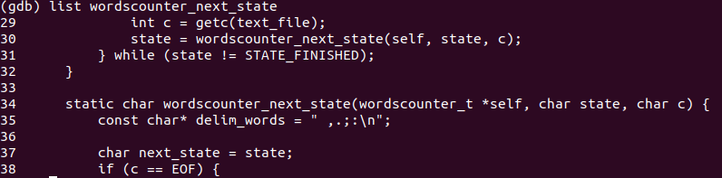

**list:** Este comando imprime mas lineas, si previamente se hizo un list como fue en este caso, se imprimen mas lineas a continuacion de la última que se había mostrado.

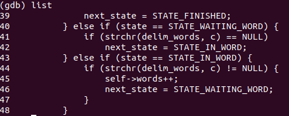

**break 45:** en este caso se setea un breakpoint en la línea 45. Un breakpoint es una forma de decirle a tu debugger (en este caso GDB): “quiero que pares en esta línea”. Para de esta manera, podes inspeccionar con más detalle alrededor de esta línea en el programa, sea variables, memoria, etc.

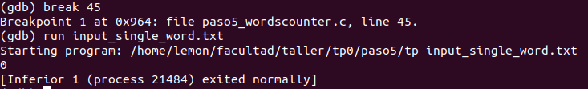

**run input_singe_word.txt:** corre nuestro programa con el archivo que le pasamos como input mostrándonos la salida como podemos ver en la captura.

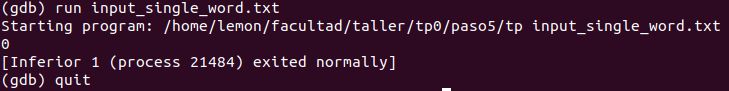

### Paso 6

**a. Describa en breves palabras las correcciones realizadas respecto de la versión anterior.**

Se cambio el número de error de -1 a 1 en el main. Luego, las delim_words se definieron como una constante en el file .c en vez de en la función. Y luego se agregó el strchr para comparar con los delimitadores en la lógica del próximo estado del wordscounter.

**b. Captura de pantalla mostrando t​odas las entregas realizadas​ , tanto exitosas como fallidas.**

Captura desde SERCOM:

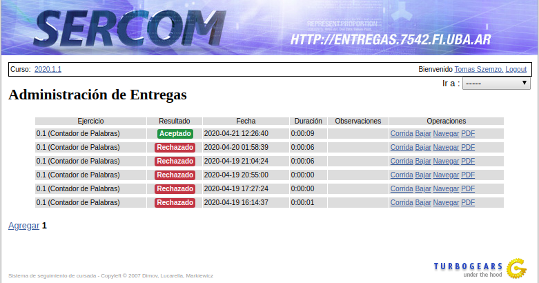

**c. Captura de pantalla mostrando la ejecución de la prueba ‘Single Word’ de forma local​ con las distintas variantes indicadas.**

Corrida 1: make + input

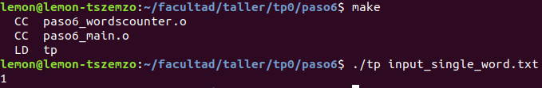

Corrida 2: <input

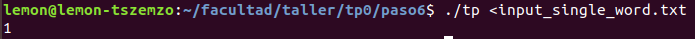

Corrida 3: <input + >output

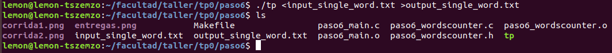

